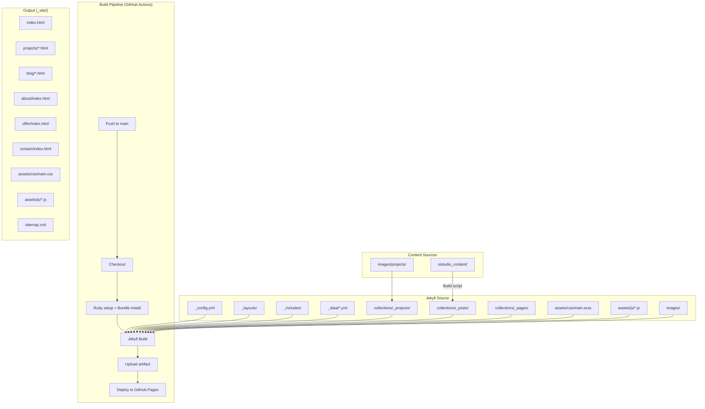

# Design Document: Premium Interior Design Website

## Overview

Si Studio's website is a complete rebuild of a premium interior design portfolio site using Jekyll 4.x, deployed via GitHub Actions to GitHub Pages. The design draws inspiration from top London interior design firms (Henri Fitzwilliam Lay, Taylor Howes, Sims Hilditch) — characterized by generous whitespace, full-bleed photography, restrained typography, and understated scroll-triggered animations.

The architecture replaces the existing bookshop-based template with a bespoke Jekyll site that leverages:
- 23 interior design project portfolios (images in `images/projects/` with `glowne_*` featured images)
- 100+ Instagram posts from `sistudio_content/` (YYYYMMDD date prefix, `.txt` captions, `.jpg` images with `_N` numbered suffixes)
- Personal designer photos (`images/personal/Iga_1.jpg`, `Iga_2.jpg`)
- Logo assets in multiple sizes (`images/logo/`)
- Social links (Facebook, Instagram) from `_data/social_links.yml`

All content is in Polish. No external build tools beyond Jekyll plugins and GitHub Actions are required. No new images will be created — only existing repository assets are used.

### Key Design Decisions

1. **No external CSS framework** — Custom SCSS compiled by Jekyll's built-in Sass pipeline. This avoids Tailwind/PostCSS build complexity that GitHub Pages doesn't natively support, and keeps CSS surgically minimal for a high-performance site.
2. **Vanilla JavaScript** — No React, Vue, or jQuery. Intersection Observer API for scroll animations, native lazy loading, CSS custom properties for theming.
3. **Jekyll collections for projects** — Leverage the existing `_projects` collection (output: true) with enhanced front matter.
4. **Blog posts generated from Instagram data** — A Jekyll plugin or build script converts `sistudio_content/` files into `_posts` format during CI, or we use Jekyll data files + collection pages to render them.
5. **Google Fonts via preconnect + swap** — Two typefaces maximum (serif headings, sans-serif body), ≤3 weights each.

---

## Architecture



### Build Flow

1. **Pre-build script** (runs in GitHub Actions before `jekyll build`): Parses `sistudio_content/` directory, generates Jekyll-compatible `_posts` markdown files with proper front matter from `.txt` + `.jpg` pairs.
2. **Jekyll build**: Compiles Sass, processes Liquid templates, generates all HTML pages, produces sitemap.xml.
3. **Output**: Static `_site/` directory deployed to GitHub Pages.

### Directory Structure (Target)

```
├── _config.yml                    # Updated Jekyll configuration
├── _data/
│   ├── navigation.yml            # Menu items
│   ├── social_links.yml          # Social media links
│   ├── colors.yml                # Design tokens (palette)
│   └── services.yml              # Offer page services data
├── _includes/
│   ├── head.html                 # Meta, fonts, CSS
│   ├── header.html               # Navigation system
│   ├── footer.html               # Footer with links, social, copyright
│   ├── hero.html                 # Homepage hero section
│   ├── loader.html               # Page loading indicator
│   ├── lightbox.html             # Full-screen image lightbox
│   ├── seo.html                  # JSON-LD structured data
│   └── scroll-indicator.html     # Bounce arrow SVG
├── _layouts/
│   ├── default.html              # Base layout (loader, header, content, footer)
│   ├── page.html                 # Standard page layout
│   ├── project.html              # Individual project gallery
│   ├── post.html                 # Individual blog post
│   └── blog.html                 # Blog index with pagination
├── _sass/
│   ├── _variables.scss           # Color tokens, typography scale, spacing
│   ├── _reset.scss               # CSS reset / normalize
│   ├── _typography.scss          # Font faces, scale, headings
│   ├── _layout.scss              # Grid, container, responsive
│   ├── _navigation.scss          # Header, mobile menu
│   ├── _hero.scss                # Hero section styles
│   ├── _portfolio.scss           # Project grid and cards
│   ├── _blog.scss                # Blog cards and post layout
│   ├── _about.scss               # About page split layout
│   ├── _offer.scss               # Services cards, process steps
│   ├── _contact.scss             # Contact form styling
│   ├── _footer.scss              # Footer layout
│   ├── _lightbox.scss            # Lightbox overlay
│   ├── _loader.scss              # Page loader animation
│   └── _animations.scss          # Scroll reveal, parallax classes
├── assets/
│   ├── css/main.scss             # Sass entry point (imports all partials)
│   └── js/
│       ├── navigation.js         # Mobile menu toggle, scroll state
│       ├── scroll-animations.js  # Intersection Observer reveals
│       ├── parallax.js           # Hero parallax effect
│       ├── lightbox.js           # Image lightbox logic
│       ├── loader.js             # Page load sequence
│       ├── contact.js            # Form validation + submission
│       └── consent.js            # Cookie/analytics consent (if needed)
├── collections/
│   ├── _pages/                   # Site pages (index, about, projects, etc.)
│   ├── _projects/                # 23 project entries
│   └── _posts/                   # Generated blog posts
├── images/
│   ├── projects/                 # 23 project folders with photos
│   ├── personal/                 # Iga_1.jpg, Iga_2.jpg
│   └── logo/                     # Logo in multiple sizes + SVG
├── sistudio_content/             # Instagram source data (read-only)
└── scripts/
    └── generate-posts.rb         # Pre-build script: sistudio_content → _posts
```

---

## Components and Interfaces

### 1. Page Loader (`_includes/loader.html` + `assets/js/loader.js`)

**Purpose**: Display Si Studio logo with fade-in + slide-up animation while page loads.

**Interface**:
- Inline markup + styles (< 5KB) injected at top of `<body>` in `default.html`
- `loader.js` listens for `DOMContentLoaded`, triggers fade-out after a minimum display time
- Force-hide timeout at 3000ms via `setTimeout`
- Emits a custom event `si:page-ready` when transition completes, which other scripts listen for

**Behavior**:
- On page load: Logo fades in (300ms) + slides up 20px
- On `DOMContentLoaded`: Loader fades out (600ms), page content fades in (500ms)
- Total transition ≤ 2100ms
- `prefers-reduced-motion`: Loader shows statically, hides instantly once content ready

### 2. Navigation System (`_includes/header.html` + `assets/js/navigation.js`)

**Purpose**: Fixed top navigation with transparent → opaque scroll transition, mobile hamburger overlay.

**Interface**:
```html
<header class="site-header" data-scroll-threshold="80">
  <nav class="site-nav" aria-label="Nawigacja główna">
    <a class="site-nav__logo" href="/">
      
    </a>
    <ul class="site-nav__links" role="menubar">...</ul>
    <button class="site-nav__toggle" aria-expanded="false" aria-controls="mobile-menu">
      <span class="sr-only">Menu</span>
    </button>
  </nav>
  <div class="mobile-menu" id="mobile-menu" role="dialog" aria-modal="true">...</div>
</header>
```

**States**:
- `scroll < 80px`: `background: transparent`
- `scroll >= 80px`: `background: rgba(var(--color-bg-rgb), 0.95); backdrop-filter: blur(8px)` — transition 300ms
- Mobile menu open: Full-screen overlay, focus trap, staggered link reveals (50–100ms per item, total ≤ 600ms)
- `prefers-reduced-motion`: Instant state changes, no stagger

**Active page**: Current link gets `aria-current="page"` + underline indicator (2px below, using `border-bottom` for non-color-dependent distinction).

### 3. Hero Section (`_includes/hero.html` + `assets/js/parallax.js`)

**Purpose**: Full-viewport cinematic opening with project photography, studio name, tagline, parallax.

**Interface**:
```html
<section class="hero" aria-label="Si Studio — projektowanie wnętrz">
  <div class="hero__image" data-parallax="0.4" style="background-image: url(...)"></div>
  <div class="hero__overlay"></div>
  <div class="hero__content">
    <h1 class="hero__title">Si Studio</h1>
    <p class="hero__tagline">Projektowanie wnętrz z pasją i precyzją</p>
  </div>
  <div class="hero__scroll-indicator" aria-hidden="true">
    <svg><!-- chevron down --></svg>
  </div>
</section>
```

**Parallax**: `parallax.js` uses `requestAnimationFrame` + `transform: translate3d(0, Ypx, 0)` at 0.3–0.5× scroll rate. Only active when `prefers-reduced-motion` is not set.

**Fallback**: If hero image fires `error` event (via JS), the `.hero__image` element gets `background-color: var(--color-warm-taupe)`.

**Scroll indicator**: CSS-only bounce animation (`@keyframes bounce`, 2000ms cycle, infinite).

**Text reveal**: Staggered `opacity: 0 → 1` + `translateY(20px → 0)` on h1 and tagline, total 1200ms, triggered by `si:page-ready` event.

### 4. Portfolio Gallery (`collections/_pages/projects.html` + `_layouts/project.html`)

**Purpose**: Grid showcase of 23 projects; individual project pages with vertical gallery + lightbox.

**Grid layout**:
- Mobile (< 768px): 1 column
- Tablet (768px–1023px): 2 columns
- Desktop (1024px+): 3 columns
- Gap: 16px mobile, 24px tablet/desktop
- CSS Grid with `auto-fill` / `minmax()`

**Card component**:
```html
<a href="/project/{{ project.slug }}" class="project-card">
  <div class="project-card__image-wrap">
    
  </div>
  <div class="project-card__overlay">
    <h3 class="project-card__title">{{ project.title }}</h3>
  </div>
</a>
```

**Hover effect** (desktop): Image scales 1.03–1.05× via `transform: scale(1.04)`, title fades in over 300ms. No layout shift (overflow: hidden on wrapper).

**Project page** (`project.html` layout): Vertical image stack, 48px spacing desktop / 24px mobile. Click-to-lightbox on each image.

**Title formatting**: Folder name → replace `_` with space → Polish title case (capitalize first word and proper nouns). Stored in front matter `title` field.

### 5. Lightbox (`_includes/lightbox.html` + `assets/js/lightbox.js`)

**Purpose**: Full-screen image viewer with navigation.

**Controls**:
- Previous / Next buttons (visible on desktop, swipe on mobile)
- Keyboard: Left/Right arrows, Escape to close
- Touch: Swipe left/right gestures (pointer events)
- Close button (top-right corner)

**Behavior**:
- Opens with fade-in (300ms)
- Image transitions with crossfade (200ms)
- Focus trapped inside lightbox while open
- `aria-modal="true"`, `role="dialog"`
- Navigation controls only receive focus/events while lightbox is open

### 6. Blog Engine (`scripts/generate-posts.rb` + `_layouts/post.html` + blog layout)

**Purpose**: Transform Instagram content into Jekyll blog posts.

**Build script** (`generate-posts.rb`):
1. Scan `sistudio_content/` for `.txt` files
2. Parse filename: `YYYYMMDD_SHORTCODE.txt` → date = YYYYMMDD
3. Extract title: First sentence (up to first `.` or `\n`), truncated at 80 chars + `…`
4. Find matching images: Same date+shortcode prefix, optional `_N` suffix → `YYYYMMDD_SHORTCODE.jpg`, `YYYYMMDD_SHORTCODE_1.jpg`, etc.
5. Generate `_posts/YYYY-MM-DD-shortcode.md` with front matter:

```yaml
---
title: "Extracted title"
date: YYYY-MM-DD
image: /sistudio_content/YYYYMMDD_SHORTCODE.jpg  # or _1.jpg
images:
  - /sistudio_content/YYYYMMDD_SHORTCODE_1.jpg
  - /sistudio_content/YYYYMMDD_SHORTCODE_2.jpg
tags: [extracted, hashtags]
---
Full text content from .txt file
```

6. If no `.jpg` exists for a `.txt`, use site default placeholder image path.

**Blog index**: 12 posts per page, reverse chronological. Pagination via jekyll-paginate or manual Liquid logic. Cards with featured image, title, date (DD.MM.YYYY format).

**Individual post page**: Full text content, all images displayed vertically in suffix order.

### 7. About Page (`collections/_pages/about.html`)

**Layout**: Split grid — 7/12 image : 5/12 text on desktop (768px+). Single column (image above text) on mobile.

**Content**: `images/personal/Iga_1.jpg` (or `Iga_2.jpg`), biographical text (designer name, studio founding, education, specializations).

**Animations**: Image scale-in (900ms), text fade-up (800ms per block, 100–150ms stagger). Triggered at 85% viewport intersection. `prefers-reduced-motion`: Content visible immediately, no animation.

### 8. Offer Page (`collections/_pages/offer.html`)

**Data-driven**: Services defined in `_data/services.yml` (2–6 items). Process steps also in data file (3–7 steps).

**Layout**: Service cards in responsive grid. Process steps as numbered vertical timeline. CTA button links to `/contact/`.

**Animations**: Staggered reveal, total ≤ 1000ms. If 6 cards visible, per-card delay = 166ms. At 4 cards, 250ms per card.

### 9. Contact Form (`collections/_pages/contact.html` + `assets/js/contact.js`)

**Fields**: Name (required, max 100), Email (required, max 254, pattern validation), Phone (optional, max 20), Message (required, max 2000).

**Validation**: Client-side JavaScript. Email regex: `/\S+@\S+\.\S+/`. Required fields: at least 1 non-whitespace character.

**Submission**: Form action to a static-site-compatible service (e.g., Formspree, or mailto: fallback). On success: confirmation message, fields cleared. On error: error message, fields preserved.

**Alongside**: Studio email address displayed, social media links (Facebook, Instagram).

### 10. Animation Engine (`assets/js/scroll-animations.js`)

**Approach**: Single Intersection Observer instance with threshold 0.15 (15% viewport entry). Elements with `[data-animate]` attribute get observed.

**Animation classes**:
- `fade-up`: `opacity: 0; transform: translateY(24px)` → `opacity: 1; transform: translateY(0)`
- `fade-in`: `opacity: 0` → `opacity: 1`
- `scale-in`: `opacity: 0; transform: scale(0.95)` → `opacity: 1; transform: scale(1)`

**Constraints**:
- Only `transform` and `opacity` properties animated (GPU-composited)
- Duration: 150ms – 1000ms per animation
- Deferred until after `DOMContentLoaded` + loader completion
- `prefers-reduced-motion`: All animated elements start in final state; observer not initialized

### 11. SEO Component (`_includes/seo.html`)

**JSON-LD**: LocalBusiness schema on homepage (name: "Si Studio", address: Szczecin, url, telephone).

**Per-page meta**: `og:title`, `og:description`, `og:image`, `og:url`. Canonical URL. Unique meta descriptions (50–160 chars) generated from front matter `description` field.

**Semantic HTML**: `<header>`, `<nav>`, `<main>`, `<article>`, `<section>`, `<footer>` used throughout all templates.

---

## Data Models

### Project Front Matter

```yaml
---
title: "Apartament Premium Nad Morzem"      # Display title (Polish)
date: 2021-01-05                              # For ordering
image: "/images/projects/apartament_premium_nad_morzem/glowne_Miedzywodzie.jpg"
description: "Luksusowy apartament z widokiem na morze" # SEO (50-160 chars)
gallery:
  - "/images/projects/apartament_premium_nad_morzem/lazienka.jpg"
  - "/images/projects/apartament_premium_nad_morzem/salon1.jpg"
  - "/images/projects/apartament_premium_nad_morzem/salon2.jpg"
  - "/images/projects/apartament_premium_nad_morzem/sypialnia.jpg"
tags: [apartament, nadmorski, premium]
---
```

### Blog Post Front Matter (Generated)

```yaml
---
title: "Męska łazienka jako mocny akcent w subtelnej, jasnej przestrzeni"
date: 2025-02-07
image: "/sistudio_content/20250207_DFxKBQWsD30_1.jpg"
images:
  - "/sistudio_content/20250207_DFxKBQWsD30_1.jpg"
  - "/sistudio_content/20250207_DFxKBQWsD30_2.jpg"
  - "/sistudio_content/20250207_DFxKBQWsD30_3.jpg"
tags: [interiordesign, minimalizm, lazienka]
description: "Męska łazienka jako mocny akcent w subtelnej, jasnej przestrzeni otoczonej naturą"
---
```

### Color Palette Data (`_data/colors.yml`)

```yaml
palette:
  cream: "#FAF7F2"          # Primary background
  warm-white: "#FFFFFF"      # Card backgrounds, overlays
  soft-taupe: "#C4B5A4"     # Borders, muted elements
  charcoal: "#2C2C2C"       # Primary text
  accent: "#8B7355"         # Interactive elements (warm bronze)

rgb:
  cream: "250, 247, 242"
  warm-white: "255, 255, 255"
  charcoal: "44, 44, 44"
```

### Services Data (`_data/services.yml`)

```yaml
services:
  - name: "Projekt koncepcyjny"
    description: "Wizualizacja i plan aranżacji wnętrza dopasowany do Twojego stylu życia"
  - name: "Projekt wykonawczy"
    description: "Kompletna dokumentacja techniczna gotowa do realizacji"
  - name: "Nadzór autorski"
    description: "Kontrola jakości wykonania na każdym etapie realizacji"

process:
  - step: 1
    label: "Konsultacja"
  - step: 2
    label: "Koncepcja"
  - step: 3
    label: "Projekt"
  - step: 4
    label: "Realizacja"
  - step: 5
    label: "Odbiór"
```

### Navigation Data (`_data/navigation.yml` — updated)

```yaml
logo_image: "/images/logo/logo.svg"
logo_text: "Si Studio"

menu__settings:
  menu__items:
    - title: "Home"
      url: "/"
    - title: "Projekty"
      url: "/projects/"
    - title: "O Mnie"
      url: "/about/"
    - title: "Blog"
      url: "/blog/"
    - title: "Oferta"
      url: "/offer/"
    - title: "Kontakt"
      url: "/contact/"
```

### CSS Custom Properties (Design Tokens)

```scss
:root {
  // Colors
  --color-bg: #FAF7F2;
  --color-bg-rgb: 250, 247, 242;
  --color-surface: #FFFFFF;
  --color-text: #2C2C2C;
  --color-text-muted: #6B5E52;
  --color-border: #C4B5A4;
  --color-accent: #8B7355;
  --color-accent-hover: #7A6548;

  // Typography
  --font-display: 'Cormorant Garamond', 'Georgia', serif;
  --font-body: 'Montserrat', 'Helvetica Neue', sans-serif;
  --type-scale: 1.25;  // Major third
  --font-size-base: 1rem;    // 16px
  --font-size-sm: 0.875rem;  // 14px
  --font-size-h4: 1.25rem;   // 20px
  --font-size-h3: 1.563rem;  // 25px
  --font-size-h2: 1.953rem;  // 31px
  --font-size-h1: 2.441rem;  // 39px
  --line-height-body: 1.6;

  // Spacing
  --space-section-mobile: 24px;
  --space-section-desktop: 48px;
  --space-content-max: 1400px;

  // Animation
  --duration-fast: 200ms;
  --duration-medium: 400ms;
  --duration-slow: 800ms;
  --ease-out: cubic-bezier(0.16, 1, 0.3, 1);
}
```

---

## Correctness Properties

*A property is a characteristic or behavior that should hold true across all valid executions of a system — essentially, a formal statement about what the system should do. Properties serve as the bridge between human-readable specifications and machine-verifiable correctness guarantees.*

The following properties focus on the **pure logic** components of the site — the data transformations, validation functions, and build-time content generation that have variable inputs and testable outputs. UI rendering, animation timing, and layout concerns are covered by example-based and integration tests instead.

### Property 1: Folder Name to Display Title Transformation

*For any* project folder name string containing underscores, replacing underscores with spaces and applying title-case capitalization SHALL produce a string where every word starts with a capital letter and contains no underscore characters.

**Validates: Requirements 3.2**

### Property 2: Blog Post Generation from Instagram Content

*For any* `.txt` file in `sistudio_content` with a valid `YYYYMMDD_SHORTCODE` filename prefix, the generation script SHALL produce a Jekyll post file with: a `date` field matching the parsed date, a `title` field extracted from the text content, an `image` field pointing to either the corresponding `.jpg` file or the default placeholder, and body content matching the full `.txt` file content.

**Validates: Requirements 4.1**

### Property 3: Date Format Transformation

*For any* valid date in YYYYMMDD format (where YYYY is 2020–2030, MM is 01–12, DD is 01–31 and valid for the given month), formatting to DD.MM.YYYY SHALL produce a string where the day and month are zero-padded two-digit numbers separated by dots, and parsing the output back SHALL yield the original date components.

**Validates: Requirements 4.2**

### Property 4: Blog Title Extraction

*For any* non-empty text string, the title extraction function SHALL return a string that is either: (a) the substring up to the first period or newline character if that substring is ≤ 80 characters, or (b) the first 80 characters of the text followed by "…" if no period or newline occurs within the first 80 characters. The result SHALL never exceed 81 characters (80 + ellipsis character).

**Validates: Requirements 4.3**

### Property 5: Image Suffix Numerical Ordering

*For any* set of image filenames sharing the same date-shortcode prefix with numeric suffixes (`_1`, `_2`, `_3`, … `_N`), sorting them by the generation script SHALL produce a sequence where each suffix number is strictly greater than the previous one (ascending numerical order, not lexicographic).

**Validates: Requirements 4.5**

### Property 6: Blog Pagination Invariants

*For any* total post count N ≥ 1, the pagination system SHALL produce exactly `ceil(N / 12)` pages, where each page contains at most 12 posts, the first page contains posts 1–12 (or all N if N ≤ 12), and no page contains zero posts.

**Validates: Requirements 4.6**

### Property 7: Required Field Validation

*For any* string input, the required-field validator SHALL accept the input if and only if it contains at least one character that is not a whitespace character (space, tab, newline, carriage return). Empty strings and strings composed entirely of whitespace SHALL be rejected.

**Validates: Requirements 7.2**

### Property 8: Email Pattern Validation

*For any* string input, the email validator SHALL accept the input if and only if it matches the pattern `\S+@\S+\.\S+` (one or more non-whitespace characters, followed by @, followed by one or more non-whitespace characters, followed by a dot, followed by one or more non-whitespace characters). Strings without `@`, without a dot after `@`, or with whitespace in any segment SHALL be rejected.

**Validates: Requirements 7.3**

---

## Error Handling

### Image Load Failures
- **Hero image**: JS `error` event listener sets `background-color: var(--color-border)` (soft taupe). Text overlay remains visible and readable against the solid background.
- **Portfolio cards**: CSS `background-color` on container matches palette. Alt text displayed via browser default.
- **Blog featured images**: If no `.jpg` matched to `.txt` during build, a default placeholder image path is written to front matter.
- **All images**: Explicit `width`/`height` attributes prevent CLS. Alt text always present.

### Form Submission
- **Network error / timeout**: Display Polish-language error: "Nie udało się wysłać wiadomości. Spróbuj ponownie później." Preserve all field data. No stack traces or technical details exposed.
- **Validation failure**: Inline error messages adjacent to invalid fields. Red border + text below field. Form not submitted until corrected.
- **Success**: Green confirmation message: "Dziękujemy! Wiadomość została wysłana." All fields cleared.

### Page Loading
- **Loader timeout**: If animation not complete within 3000ms, `loader.js` applies `.loader--hidden` class via `setTimeout`, which triggers CSS `display: none` after opacity transition.
- **Missing pages**: Custom `404.html` using `default` layout with full header/footer, message in Polish, and link back to homepage.

### Build Resilience
- **Missing `.txt` files**: Skip silently (no post generated).
- **Malformed filenames**: Skip files not matching `YYYYMMDD_` prefix pattern.
- **Missing project images**: If no `glowne_*` image found in a project folder, front matter uses a palette-matching SVG placeholder.
- **Empty text files**: Generate post with empty body (title becomes "Bez tytułu").

### Reduced Motion
- All animation JS checks `window.matchMedia('(prefers-reduced-motion: reduce)')` before initialization.
- Content rendered in final visible state immediately (opacity: 1, transforms reset).
- Page loader still waits for DOM ready, but transitions are instant (no visual motion).
- Navigation background change is instant (no 300ms transition).

---

## Testing Strategy

### Property-Based Tests (PBT)

**Library**: [fast-check](https://github.com/dubzzz/fast-check) (JavaScript) for client-side validation logic, or a Ruby equivalent for the build script. Since the generation script is Ruby and the validation is JS, we use both:
- **Ruby build script tests**: Use `rantly` gem or equivalent for properties 1–6
- **JavaScript validation tests**: Use `fast-check` for properties 7–8

**Configuration**: Minimum 100 iterations per property test.

**Tag format**: Each test tagged with `Feature: premium-interior-design-website, Property N: <property text>`

| Property | Target Function | Generator |
|----------|----------------|-----------|
| 1: Folder name transformation | `format_project_title(folder_name)` | Random strings with underscores, letters, digits |
| 2: Post generation | `generate_post(txt_file, jpg_files)` | Random filenames with valid date prefixes |
| 3: Date formatting | `format_date(yyyymmdd)` | Random valid dates 2020-2030 |
| 4: Title extraction | `extract_title(text)` | Random strings with/without periods and newlines |
| 5: Image ordering | `sort_images(filenames)` | Random lists of suffixed filenames |
| 6: Pagination | `paginate(posts, per_page=12)` | Random integers 1–200 |
| 7: Required validation | `validate_required(input)` | Random strings including whitespace-only |
| 8: Email validation | `validate_email(input)` | Random strings, emails with/without @ and dots |

### Unit Tests (Example-Based)

- **Build output verification**: `bundle exec jekyll build` exits 0, `_site/` contains expected pages
- **Navigation links**: All menu items resolve to pages that exist in `_site/`
- **Image paths**: All `src` attributes reference existing files
- **Specific content checks**: Footer copyright text, social link URLs, form field attributes
- **404 page**: Contains header, footer, link to homepage
- **JSON-LD**: Homepage contains valid LocalBusiness schema
- **Sitemap**: Contains entries for all project and post pages

### Integration Tests

- **Lighthouse CI**: LCP < 2500ms, CLS < 0.1, accessibility score ≥ 90
- **HTML validation**: W3C Nu HTML Checker on key pages
- **Responsive visual regression**: Screenshots at 375px, 768px, 1024px, 1400px
- **Cross-browser**: Chrome, Firefox, Safari latest
- **Accessibility audit**: axe-core automated checks, manual keyboard navigation

### Manual Testing Checklist

- [ ] Lightbox opens/closes with keyboard, touch, and mouse
- [ ] Mobile menu focus trap works
- [ ] Parallax disabled with prefers-reduced-motion
- [ ] Form submission works end-to-end
- [ ] All 23 project pages render correctly
- [ ] Blog pagination works with actual post count
- [ ] Back-to-top button appears after scrolling 100vh
- [ ] Page transitions feel smooth and under 800ms
